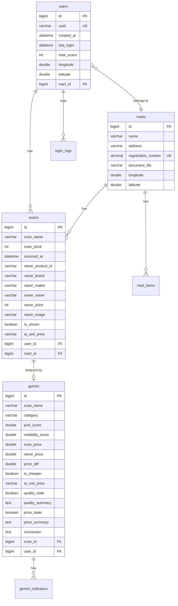

# 🛒 PicPick Backend

## 목차

- [프로젝트 개요](#-프로젝트-개요)
- [핵심 기능](#-핵심-기능)
- [기술 스택](#-기술-스택)
- [시스템 아키텍처](#-시스템-아키텍처)
- [API 엔드포인트](#-api-엔드포인트)
- [데이터베이스 스키마](#-데이터베이스-스키마)
- [프로젝트 구조](#-프로젝트-구조)
- [시작하기](#-시작하기)
- [환경 변수](#-환경-변수)
- [문서화](#-문서화)

---

## 프로젝트 개요

**PicPick**은 마트 쇼핑객을 위한 **'AI 소비 전략가'** 서비스입니다.

단순한 가격 비교를 넘어, Google Gemini AI를 활용하여 상품의 **실질적 가치**(성분, 용량, 브랜드 신뢰도 등)를 종합적으로 분석합니다. 소비자가 오프라인 마트에서 현명한 구매 의사결정을 내릴 수 있도록 **픽리포트(Pick-Report)**를 통해 즉각적인 인사이트를 제공합니다.

### 왜 PicPick인가?

| 기존 서비스 | PicPick |
|-------------|---------|
| 단순 가격 비교 | **가치 대비 가격(VFM)** 분석 |
| 온라인 가격만 표시 | **마트 vs 온라인** 실질 비교 |
| 정보 나열 | **AI 기반 구매 추천** (사라/마라) |

---

## 핵심 기능

### 1. AI 픽리포트 (Pick-Report)

- **VFM(Value for Money) 분석**: 상품의 실질 가치와 가격을 비교하여 **0.0~5.0점**의 픽스코어(Pick Score)를 산출
- **5대 지표 분석**: 카테고리별 맞춤 지표(품질, 편의성, 안전성 등)로 심층 분석
- **품질/가격 상태 표시**: `qualityState`, `priceState`로 긍정/부정 상태를 명확히 전달
- **구매 결론**: "구매 권장" 또는 "보류 권장"의 명확한 가이드 제공

### 2. 고도화된 스캔 프로세싱

- **데이터 재사용 최적화**: 동일 상품의 네이버 최저가 및 AI 분석 결과를 DB에서 재사용하여 API 호출 최소화
- **동기/비동기 하이브리드 분석**:
  - 동기: 기존 분석 데이터가 있으면 즉시 복제(Clone)하여 반환
  - 비동기: 신규 상품은 백그라운드에서 분석하여 UX 최적화

### 3. 위치 기반 스마트 마트 매칭

- 사용자의 **위도/경도**를 기반으로 가장 가까운 제휴 마트 자동 매칭
- 마트 관리자가 업로드한 **행사 상품 정보** 실시간 반영

### 4. 7대 MECE 카테고리 픽단가

상품 특성에 맞는 **픽단가(Pick Price)** 환산:

| 카테고리 | 환산 기준 | 예시 |
|----------|-----------|------|
| 신선식품 | 1인분 (고기 200g, 쌀 150g) | "1인분에 2,500원꼴" |
| 가공식품 | 1팩 / 한 끼 | "한 끼에 990원꼴" |
| 기호식품 | 1컵 (200ml) / 1봉지 | "한 잔에 450원꼴" |
| 위생용품 | 1회 / 1롤 | "한 번에 85원꼴" |
| 뷰티 | 1회 (5ml) / 1장 | "한 번에 1,200원꼴" |
| 리빙 | 월 유지비 | "사용기한당 3,000원꼴" |
| 펫/라이프 | 한 끼 (50g) | "한 끼에 650원꼴" |

### 5. 스캔 노출 관리

- `isShown` 필드를 통한 스캔 아이템 노출 상태 관리
- 조회 시 자동으로 `true`로 변경, 일괄 숨김 처리 API 제공

---

## 기술 스택

### Backend Framework
| 기술 | 버전 | 용도 |
|------|------|------|
| Java | 17 | 메인 언어 |
| Spring Boot | 3.5.8 | 애플리케이션 프레임워크 |
| Spring Data JPA | - | ORM 및 데이터 접근 |
| Spring WebFlux | - | 비동기 HTTP 클라이언트 (Naver API) |

### AI & External APIs
| 기술 | 버전 | 용도 |
|------|------|------|
| Spring AI | 1.1.2 | AI 통합 프레임워크 |
| Google Gemini | 2.5-flash-lite | 상품 분석 및 픽단가 추출 |
| Naver Search API | - | 온라인 최저가 검색 |

### Database & Migration
| 기술 | 버전 | 용도 |
|------|------|------|
| MySQL | 8.0 | 메인 데이터베이스 |
| Flyway | - | DB 마이그레이션 관리 |
| Hibernate | - | JPA 구현체 |

### Cloud & Utilities
| 기술 | 버전 | 용도 |
|------|------|------|
| AWS S3 | - | 마트 문서 파일 저장 |
| MapStruct | 1.6.2 | DTO ↔ Entity 매핑 |
| Lombok | - | 보일러플레이트 코드 제거 |
| SpringDoc OpenAPI | 2.8.5 | Swagger UI 자동 생성 |
| Apache POI | 5.2.5 | Excel 파일 처리 |

---

## 시스템 아키텍처

```
┌─────────────────────────────────────────────────────────────────────┐
│                          Mobile App (iOS)                           │
└─────────────────────────────────┬───────────────────────────────────┘
                                  │
                                  ▼
┌─────────────────────────────────────────────────────────────────────┐
│                     Spring Boot Application                         │
│  ┌───────────┐  ┌───────────┐  ┌───────────┐  ┌───────────┐         │
│  │   User    │  │   Scan    │  │  Gemini   │  │   Mart    │         │
│  │ Controller│  │ Controller│  │ Controller│  │ Controller│         │
│  └─────┬─────┘  └─────┬─────┘  └─────┬─────┘  └─────┬─────┘         │
│        │              │              │              │               │
│        ▼              ▼              ▼              ▼               │
│  ┌───────────────────────────────────────────────────────────┐      │
│  │                      Service Layer                        │      │
│  │  • UserService   • ScanService   • GeminiService          │      │
│  │  • MartService   • NaverService  • S3Service              │      │
│  └───────────────────────────────────────────────────────────┘      │
│        │              │              │              │               │
│        ▼              ▼              ▼              ▼               │
│  ┌───────────────────────────────────────────────────────────┐      │
│  │                    Repository Layer (JPA)                 │      │
│  └───────────────────────────────────────────────────────────┘      │
└─────────────────────────────────────────────────────────────────────┘
         │                    │                    │
         ▼                    ▼                    ▼
┌─────────────┐      ┌─────────────┐      ┌─────────────┐
│   MySQL DB  │      │ Naver API   │      │ Gemini API  │
│             │      │ (Shopping)  │      │ (Analysis)  │
└─────────────┘      └─────────────┘      └─────────────┘
         │
         ▼
┌─────────────┐
│   AWS S3    │
│ (Documents) │
└─────────────┘
```

---

## API 엔드포인트

### User (`/user`)
| Method | Endpoint | 설명 |
|--------|----------|------|
| `POST` | `/user/login` | UUID 기반 로그인 또는 회원가입 |
| `GET` | `/user/{userId}` | 사용자 정보 조회 |
| `PATCH` | `/user/update-location` | 위치 업데이트 및 마트 매칭 |

### Scan (`/scan`)
| Method | Endpoint | 설명 |
|--------|----------|------|
| `POST` | `/scan` | 상품 스캔 및 저장 (배치) |
| `GET` | `/scan?userId={id}` | 스캔 목록 조회 (분석 트리거) |
| `PATCH` | `/scan/hide?userId={id}` | 모든 스캔 아이템 숨김 처리 |
| `DELETE` | `/scan/{id}` | 스캔 기록 삭제 |

### Gemini (`/gemini`)
| Method | Endpoint | 설명 |
|--------|----------|------|
| `GET` | `/gemini/{scanId}` | AI 분석 리포트 조회 |

### Mart (`/mart`)
| Method | Endpoint | 설명 |
|--------|----------|------|
| `POST` | `/mart/register` | 마트 등록 |
| `POST` | `/mart/login` | 마트 로그인 |
| `PATCH` | `/mart/update-location` | 마트 위치 업데이트 |
| `POST` | `/mart/upload-file` | 행사 정보 엑셀 업로드 |
| `GET` | `/mart/{id}` | 마트 정보 조회 |
| `DELETE` | `/mart/{id}` | 마트 삭제 |
| `DELETE` | `/mart/{id}/file` | 업로드 파일 삭제 |

> 상세 API 스펙은 [api_spec.md](api_spec.md) 참조

---

## 데이터베이스 스키마



---

## 프로젝트 구조

```
src/main/java/com/picpick/
├── PicpickApplication.java          # 메인 애플리케이션
├── api/
│   ├── gemini/                       # Gemini AI 통합
│   │   ├── Gemini.java               # Entity
│   │   ├── GeminiController.java     # REST Controller
│   │   ├── GeminiService.java        # 비즈니스 로직
│   │   ├── GeminiRepository.java     # JPA Repository
│   │   ├── GeminiMapper.java         # MapStruct Mapper
│   │   └── GeminiResponse.java       # Response DTO
│   ├── naver/                        # Naver Search API
│   │   ├── Naver.java                # API 응답 DTO
│   │   ├── NaverService.java         # API 클라이언트
│   │   └── NaverResponse.java        # 응답 래퍼
│   └── s3/                           # AWS S3 연동
│       └── S3Service.java            # 파일 업로드/삭제
├── config/                           # 설정 클래스
│   ├── CorsConfig.java               # CORS 설정
│   └── AsyncConfig.java              # 비동기 설정
├── mart/                             # 마트 도메인
│   ├── Mart.java                     # Entity
│   ├── MartController.java           # REST Controller
│   └── MartService.java              # 비즈니스 로직
├── martItem/                         # 마트 행사 상품
│   └── MartItem.java                 # Entity
├── scan/                             # 스캔 도메인
│   ├── Scan.java                     # Entity
│   ├── ScanController.java           # REST Controller
│   ├── ScanService.java              # 비즈니스 로직 (핵심)
│   ├── ScanMapper.java               # MapStruct Mapper
│   └── ScanResponse.java             # Response DTO
└── user/                             # 사용자 도메인
    ├── User.java                     # Entity
    ├── UserController.java           # REST Controller
    └── UserService.java              # 비즈니스 로직
```

---

## 시작하기

### 사전 요구 사항

- **Java 17** 이상
- **MySQL 8.0** (로컬 또는 원격)
- **Gradle 8.x** (Wrapper 포함)

### 설치 및 실행

1. **레포지토리 클론**
   ```bash
   git clone https://github.com/your-repo/PicPick_BE.git
   cd PicPick_BE
   ```

2. **환경 변수 설정** (아래 섹션 참조)

3. **데이터베이스 생성**
   ```sql
   CREATE DATABASE picpick;
   ```

4. **애플리케이션 실행**
   ```bash
   ./gradlew bootRun
   ```

5. **Swagger UI 접속**
   ```
   http://localhost:8080/swagger-ui/index.html
   ```

---

## 환경 변수

프로젝트 루트에 `.env` 파일을 생성하고 다음 정보를 입력하세요:

```env
# Database
DB_URL=jdbc:mysql://localhost:3306/picpick?serverTimezone=UTC&characterEncoding=UTF-8
DB_USER=root
DB_PASSWORD=your_password

# Google Gemini AI
GEMINI_API_KEY=your_gemini_api_key
GEMINI_PROJECT_ID=your_project_id

# Naver Search API
NAVER_URL=https://openapi.naver.com
NAVER_CLIENT_ID=your_naver_client_id
NAVER_CLIENT_SECRET=your_naver_client_secret

# AWS S3
AWS_ACCESS_KEY=your_aws_access_key
AWS_SECRET_KEY=your_aws_secret_key
```

> ⚠️ `.env` 파일은 `.gitignore`에 포함되어 있어 커밋되지 않습니다.

---

## 문서화

| 문서 | 설명 |
|------|------|
| [api_spec.md](api_spec.md) | 전체 API 명세서 (Request/Response 예시 포함) |
| [user_journey.md](user_journey.md) | 사용자 여정 플로우 (시퀀스 다이어그램) |
| [Swagger UI](http://localhost:8080/swagger-ui/index.html) | 인터랙티브 API 테스트 |

---

## 라이선스

This project is licensed under the MIT License.

---
